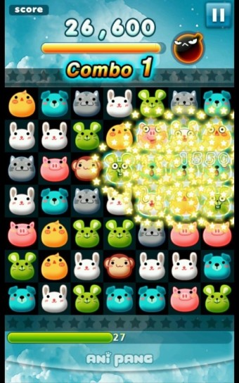

# SpgpProject

게임 컨셉
	- 애니팡과 같은 매치3 게임

개발 범위
	- 기본적인 매치3 게임 로직( 블록 이동, 매칭, 제거, 리필 )
	- 제한 시간, 일시정지, 리셋, 점수 UI
	- 4개 이상 매치 시 특수 블록( 3x3 범위 제거 폭탄, 가로 세로 줄 클리어, 특정 블록 제거 폭탄 )

예상 게임 실행 흐름
	- 메인 화면 -> 게임 시작 버튼 클릭 -> 게임 화면
	- 게임 화면 진입 시 무작위로 블록 생성
	- 플레이어의 블록 위치 변경
		- 3개 이상 매치 시 제거 -> 위에서 새로운 블록 생성
		- 매치 실패 시 원위치로
	- 제한 시간 종료 -> 결과 화면 표시
	

개발 일정
	- 1주차, 2주차 : ui 내용 구현
	- 3주차, 4주차 : 매치3 로직 구현
	- 5주차 : 블록 리필 구현
	- 6주차, 7주차 : 특수블록 구현
	- 8주차 : 버그리포트