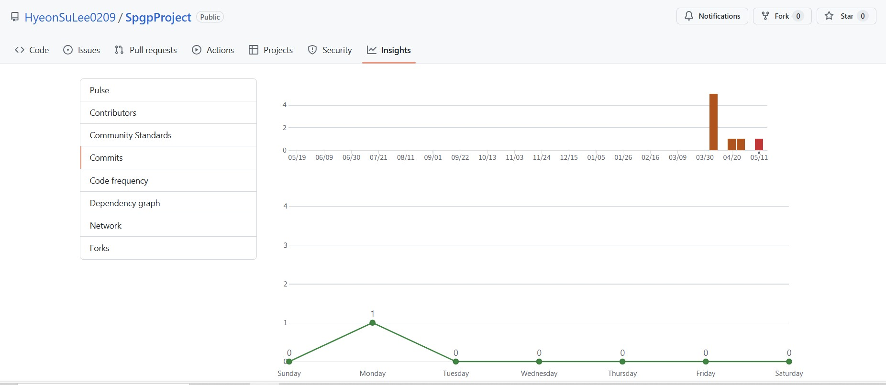

# SpgpProject

게임 컨셉
- 애니팡과 같은 매치3 게임

개발 범위
- 기본적인 매치3 게임 로직( 블록 이동, 매칭, 제거, 리필 )
- 제한 시간, 일시정지, 리셋, 점수 UI
- 4개 이상 매치 시 특수 블록( 3x3 범위 제거 폭탄, 가로 세로 줄 클리어, 특정 블록 제거 폭탄 )

예상 게임 실행 흐름
- 메인 화면 -> 게임 시작 버튼 클릭 -> 게임 화면
- 게임 화면 진입 시 무작위로 블록 생성
	- 블록들은 일단 가만히 있는 상태로 개발
		- 추후 움짐임을 넣을 수 있으면 넣는 것으로 함
	- 블록의 종류는 총 6종류( 실제 애니팡은 7종류 )
- 플레이어의 블록 위치 변경
	- 3개 이상 매치 시
		- 해당 블록을 제거
		- 위에서 새로운 블록 생성
		- 새로 생성된 블록들이 또 매치 될 경우 콤보 발생
			- 1콤보 시 기본 점수( 우선 3블록 100점, 4블록 200점, 5블록 300점 )
			- 이후 콤보 시 기본 점수 * 1.x 점수 획득( x는 현재 콤보 - 1 )
		- 특정 블록 갯수 제거 시 제한시간 증가 블록 생성
			- 일단은 30개로 설정
			- 해당 블록은 터치 시 사라지며 제한 시간 5초 증가
	- 매치 실패 시 원위치로
- 제한 시간 종료 시 게임 종료
	- 제한 시간은 1분 30초
	- 하이스코어( Top 1~10 )일 경우 기록
	- 아닐 경우 처음 시작화면으로

개발 일정
- 1주차, 2주차 : ui 내용 구현
- 3주차, 4주차 : 블록 이동, 매칭, 제거 구현
- 5주차 : 블록 리필 구현
- 6주차, 7주차 : 특수블록 구현
- 8주차 : 버그리포트

//--------------------------------------------------------------------------------------------------------------------
2차 발표

애니팡 같은 매치3 게임

현재까지 개발 진행 상황
	- 메인 화면 -> 게임 시작 버튼 클릭 -> 게임 화면 구현 완료 => 100%
	- 제한 시간, 일시정지, 리셋, 점수 UI 중 일시 정지, 리셋 제외 구현 완료 => 50%
	- 게임 화면 진입 시 무작위로 블록 생성 구현 완료 => 100%
		- 현재 블록들은 좌우로 움직이며, 총 6종류 존재
	- 블록의 이동 개발 완료 => 100%
	- 블록의 매칭 여부까지는 확인 이후 삭제 처리 하여야 함 => 50%

MainScene 에 등장하는 game object
	- 블록 오브젝트
		- 드래곤 플라이트 수업에서 사용한 숫자 1~6 숫자 블록 6개
